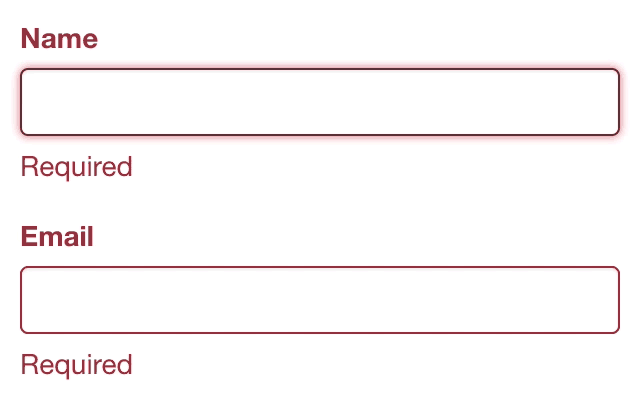

# shinyvalidate

<!-- badges: start -->

[](https://github.com/rstudio/shinyvalidate/actions) <!-- badges: end -->

**WARNING: Highly experimental, API still in flux**

## Overview

shinyvalidate adds input validation capabilities to [Shiny](https://shiny.rstudio.com).

## Installation

shinyvalidate is not yet available on CRAN. In the meantime, you can install it from GitHub using the remotes package.

``` {.r}
remotes::install_github("rstudio/shinyvalidate")
```

## Basic usage

To add validation to your Shiny app, you need to:

1.  Create an InputValidator object: `iv <- InputValidator$new()`
2.  Add one or more validation rules to the InputValidator: `iv$add_rule("title", need, message = "A title is required")`
3.  Turn the validator on: `iv$enable()`

That's all you need to do to get validation messages to show up. Here is a simple example:

{width="316"}

``` {.r}
library(shiny)
library(shinyvalidate)

ui <- fluidPage(
  textInput("name", "Name"),
  textInput("email", "Email")
)

server <- function(input, output, session) {
  iv <- InputValidator$new()
  iv$add_rule("name", sv_required())
  iv$add_rule("email", sv_required())
  iv$add_rule("email", ~ if (!is_valid_email(.)) "Please provide a valid email")
  iv$enable()
}

# From https://www.nicebread.de/validating-email-adresses-in-r/
is_valid_email <- function(x) {
  grepl("^\\s*[A-Z0-9._%+-]+@[A-Z0-9.-]+\\.[A-Z]{2,}\\s*$", as.character(x), ignore.case=TRUE)
}

shinyApp(ui, server)
```

To learn about other features of shinyvalidate, including deferred validation, programmatically accessing validation results, and validating Shiny modules, see the Getting Started guide.

## Input widget compatibility

shinyvalidate should work with all of the inputs that are included in Shiny. It will also work with most custom inputs that follow Bootstrap 3 conventions. Other types of custom inputs can include their own logic for displaying shinyvalidate error messages; see the (TODO) article to learn more.

## Prior art

-   [Shiny's built-in validation](https://shiny.rstudio.com/articles/validation.html). The `shiny::validate()` function fits naturally with Shiny's reactive programming model, but has limited usefulness because it only shows validation feedback in downstream reactive outputs, instead of providing the feedback next to the incorrect input, where users expect it.

-   [shinyFeedback](https://github.com/merlinoa/shinyFeedback) by [@merlinoa](<https://github.com/merlinoa>), who graciously provided feedback on the design of shinyvalidate. Compared to shinyFeedback, shinyvalidate aims to have a more concise but less flexible R API; and on the UI side, shinyFeedback displays richer feedback on a hard-coded set of components, while shinyvalidate feedback is minimalist but aims to support a larger set of components and is extensible for custom inputs.
